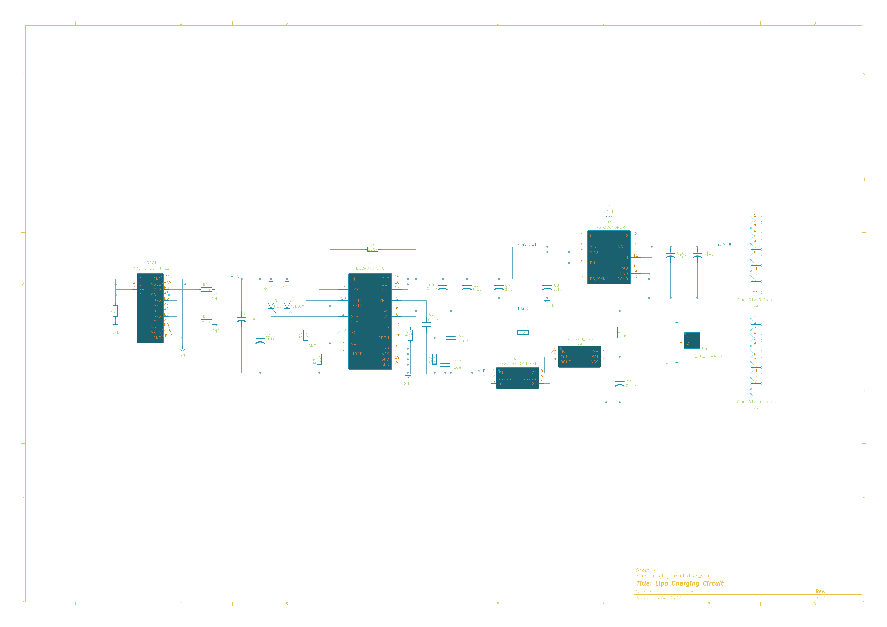
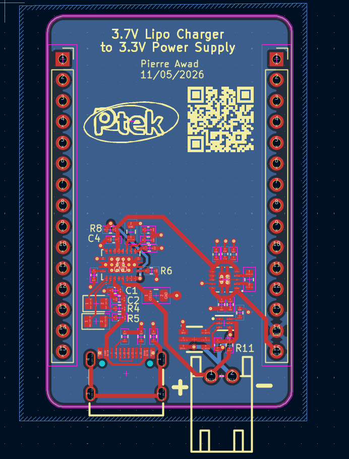
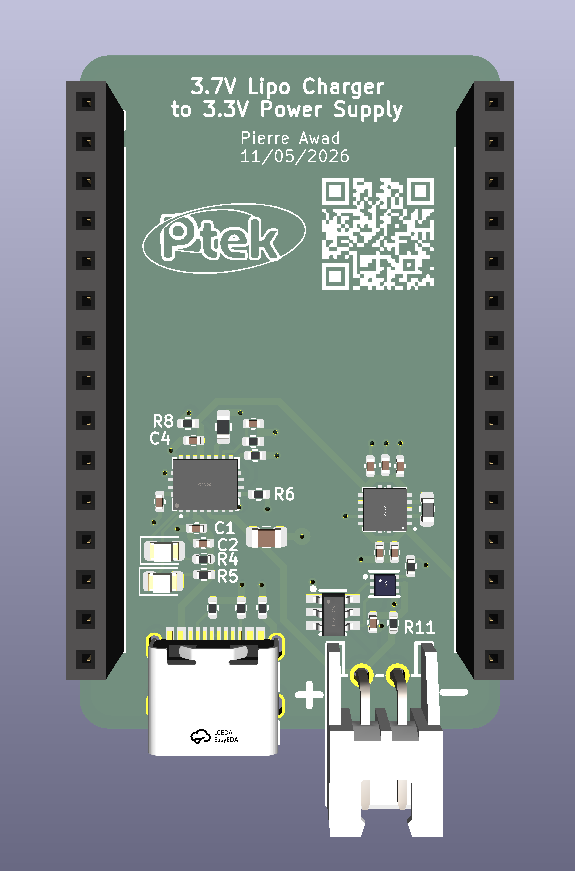
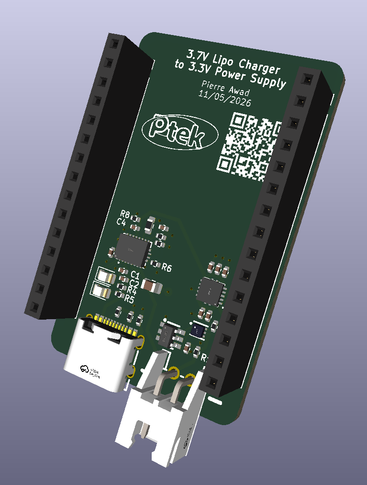
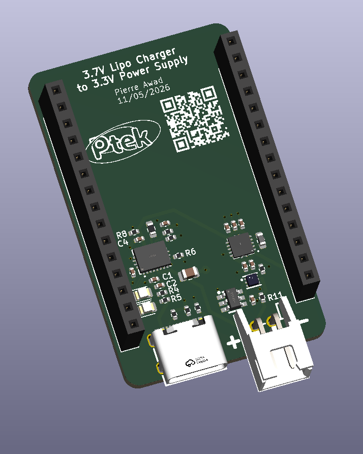

# 3.7V Lipo Charger to 3.3V Power Supply 

A 3.7V LiPo battery charging circuit coupled with a buck-boost converter to provide steady **3.3V** for an **ESP32**

**View the [interactive BOM](https://pierretek.github.io/ESP32-Lipo-Powersupply/) here!**
 
## Features 
- Battery under-voltage and over-voltage protection **(2.800V - 4.275V)**
- Built-in buck-boost converter to provide a steady 3.3V to the ESP32
- A pair of 1*15 pin headers compatible with a `30-pin ESP32 Devkit V1` 
- `USB-C` port for charging, and `2.54mm JST-XH` connector for battery
- Can charge the lipo battery at **~485mA** while providing **~500mA** to the ESP32

> [!NOTE]
> To keep the ESP32’s pins accessible, use [stacking headers](https://www.aliexpress.com/item/1005008090018820.html) so the board can plug into a breadboard or another module underneath.

## Important Files
- KiCad project: `/kicad`
- JLCPCB production files: `/production_files`
- Gerbers: `/gerber`
  
## Key IC's
- **[BQ24070RHLR](https://jlcpcb.com/partdetail/TexasInstruments-BQ24070RHLR/C6514)** - main charging IC + power path management
  - [datasheet](https://www.lcsc.com/datasheet/C6514.pdf)
- **[BQ29700DSER](https://jlcpcb.com/partdetail/TexasInstruments-BQ29700DSER/C183096)** - battery protection IC
  - [datasheet](https://www.lcsc.com/datasheet/C183096.pdf)
- **[FS8205A](https://jlcpcb.com/partdetail/FUXINSEMI-FS8205A/C908265)** - dual mosfet
  - [datasheet](https://www.lcsc.com/datasheet/C908265.pdf)
- **[TPS63001DRCR](https://jlcpcb.com/partdetail/TexasInstruments-TPS63001DRCR/C28060)** - 3.3V buck-boost converter
  - [datasheet](https://www.lcsc.com/datasheet/C28060.pdf)

## Image Gallery
### Schematic (i know its messy)

### PCB top view 

### 3D view

## Credits / Tools Used
- KiCad 
- [kicad-jlcpcb-tools](https://github.com/bouni/kicad-jlcpcb-tools) (to generate the jlcpcb files)
- [InteractiveHtmlBom](https://github.com/openscopeproject/interactivehtmlbom) (for the [interactive html BOM](https://pierretek.github.io/ESP32-Lipo-Powersupply/))

_thanks for reading_

